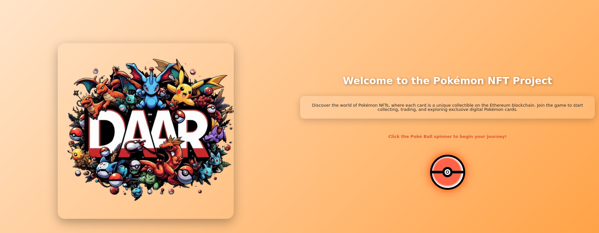

# Pokemon NFT Game

Welcome to the Pokemon NFT Game! This web application allows players to interact with virtual Bitcoin through features such as an account section, a store, and a marketplace.

 <!-- Update the path to your screenshot -->

## Done by : Alaoui Belghiti Hanaa and Mekkhishan Arulnantham.
## Link to Video to understand how it all works:
https://drive.google.com/file/d/1o79pl8ar8vUNKJu8DpQ44Ytd3PgBg5Te/view?usp=sharing
## Table of Contents

- Features
- Technologies Used
- Installation Instructions
- Contract Deployment
- Updating the Contract Address
- Usage
- Contributing
- License

## Important Note
It’s important to launch this project in Kali Linux. If you do not, you may need to manually modify parts of different resources to ensure everything works correctly.

## Features

- **User Account Management:** Manage your account details.
- **Store:** Purchase items with virtual coin.
- **Marketplace:** Trade items with other users.
- **Boosters Section:** Explore various boosters available in the game.

## Technologies Used

- **React:** For building the user interface.
- **CSS:** For styling the application.
- **Node.js:** For backend setup (if applicable).
- **Ethereum Smart Contracts:** For managing transactions.

## Installation Instructions

1. **Clone the repository:**
   ```
   git clone https://github.com/xorya0/BitcoinGame.git
   ```

2. **Navigate to the project directory:**
   ```
   cd BitcoinGame
   ```

3. **Install dependencies:** Ensure you have Node.js installed on your machine. If not, download and install it from [Node.js official website](https://nodejs.org/). Then, install the required packages:
   ```
   npm install
   ```

4. **Start the application:**
   ```
   npm start
   ```
   This will launch the app in your default web browser at `http://localhost:3000`.

5. **Connect to MetaMask:** Ensure you have the MetaMask extension installed in your browser and create or import an account. Connect your MetaMask wallet to interact with the smart contract.

6. **Obtain a Pokémon API token:** If you plan to use features related to Pokémon cards, you will need to sign up for an API token from the Pokémon card API provider. Make sure to update your application with this token where necessary.

## Contract Deployment

To use the Bitcoin Game, you need to deploy the smart contract. Follow these steps:

1. **Install Hardhat:** If you haven't already, install Hardhat globally:
   ```
   npm install --global hardhat
   ```

2. **Navigate to the Hardhat project folder:** (if you have a separate folder for smart contracts)
   ```
   cd path/to/hardhat-project
   ```

3. **Deploy the contract:**
   ```
   npx hardhat run scripts/deploy.js --network <your-network>
   ```
   Replace `<your-network>` with the network you are deploying to (like `localhost`, `rinkeby`, etc.).

4. **Take note of the deployed contract address:** After deployment, you will see the contract address in your console output.

## Updating the Contract Address

After deploying your contract, you need to update the contract address in your application:

1. **Open `App.jsx`:** Find the line where the contract address is defined.

2. **Replace the old contract address:** Update it with your new deployed contract address:
   ```
   const contractAddress = "YOUR_NEW_CONTRACT_ADDRESS"; // Replace this with your new address
   ```

## Usage

Once the application is running, you can navigate through different sections:
- **Account:** Manage your account information.
- **Store:** Buy items with your virtual currency.
- **Marketplace:** Trade items with other users.
- **Boosters:** Explore and purchase boosters to enhance your gameplay.

## Contributing

Contributions are welcome! If you would like to contribute, please follow these steps:
1. Fork the repository.
2. Create a new branch (`git checkout -b feature/YourFeature`).
3. Make your changes.
4. Commit your changes (`git commit -m 'Add some feature'`).
5. Push to the branch (`git push origin feature/YourFeature`).
6. Open a pull request.

## License

This project is licensed under the MIT License. See the LICENSE file for more information.
